<div align="center">
  <h1> 🧠 Machine Learning for Sequential Data</h1>
  </div>

This repository explores **machine learning concepts for sequential and temporal data**, including **time series, text (DNA), audio, and stock data**.  
The notebook demonstrates **data preprocessing, imputation, decomposition, and predictive modeling**, supported by a variety of visualizations stored in the [`assets/`](assets/) folder.
<div align="center">
  
</div>

---

## 🎯 Objectives

- Introduce different **types of sequential data** (time series, text sequences, audio, financial data).  
- Apply **data preprocessing** techniques such as imputation, detrending, and deseasonalization.  
- Demonstrate **class distribution analysis** for DNA sequences and tweets.  
- Use **time series decomposition** to separate trend, seasonality, and noise.  
- Visualize sequential data through plots, spectrograms, and decomposition charts.  
- Train and evaluate predictive models on sequential datasets.

---

## 🔍 Exploratory Topics & Results

### 1️⃣ Handling Missing Data — Imputation
Several imputation strategies were applied to sequential datasets with missing values:

- **Forward Fill**  
  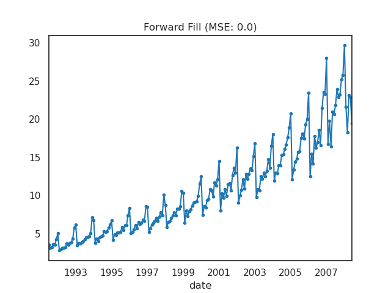

- **Backward Fill**  
  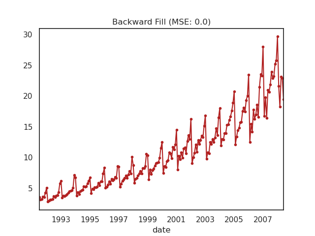

- **Linear Interpolation**  
  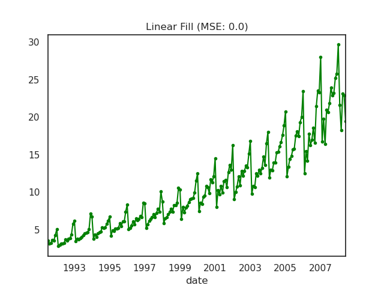

**Takeaway:**  
Forward/backward fill are simple but may propagate noise. Linear interpolation gives smoother transitions.

---

### 2️⃣ Time Series Trends & Seasonality
Drug sales and stock prices were analyzed for **long-term trend and seasonal patterns**.

- **Trend (increasing)**  
  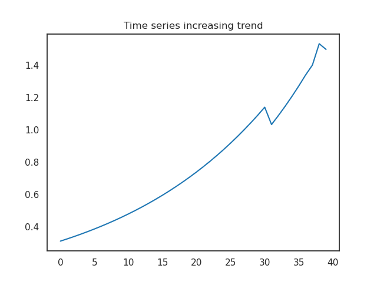

- **Seasonality**  
  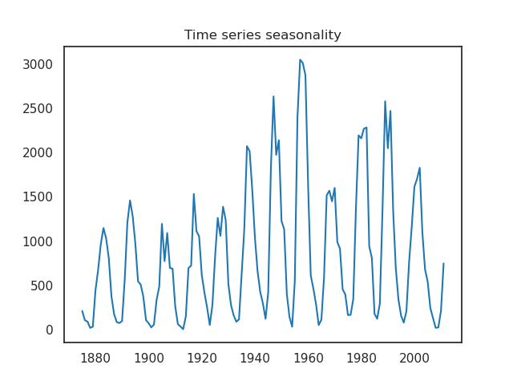

- **Cyclic Behavior**  
  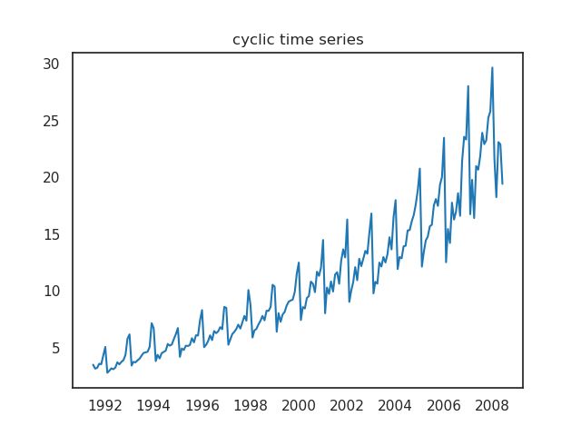

- **Seasonal + Trend**  
  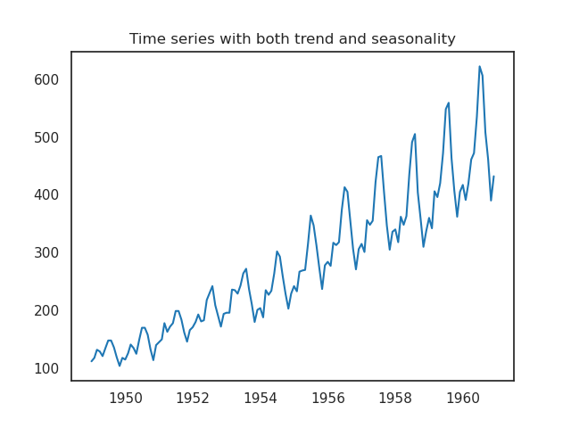

**Decomposition**  
- Additive Decomposition:  
  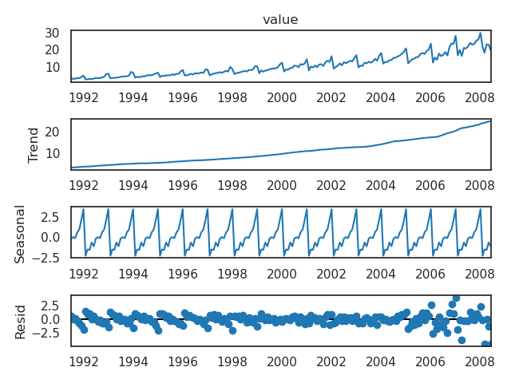

- Multiplicative Decomposition:  
  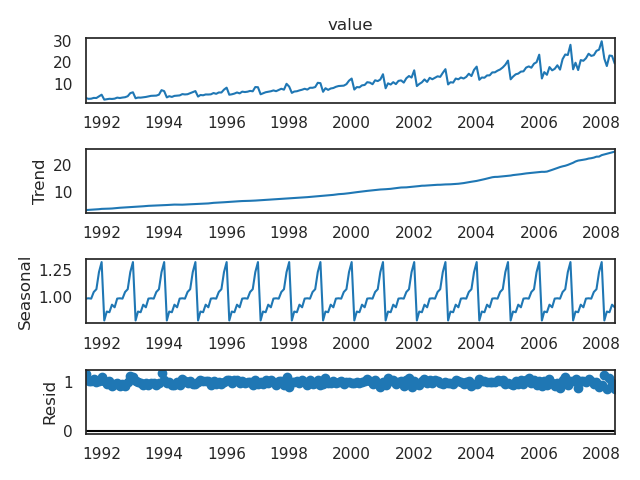

**Drug Sales Adjustments**  
- Detrended:  
  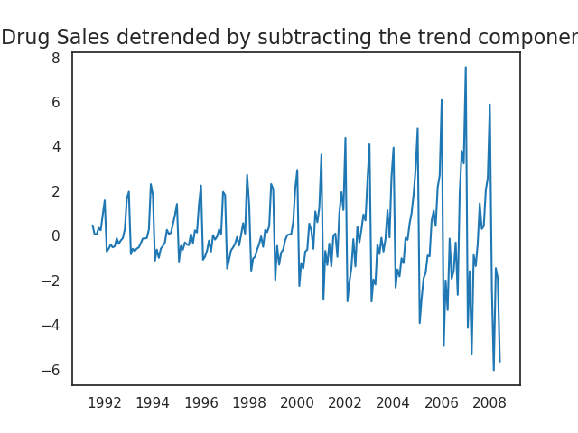  
- Deseasonalized:  
  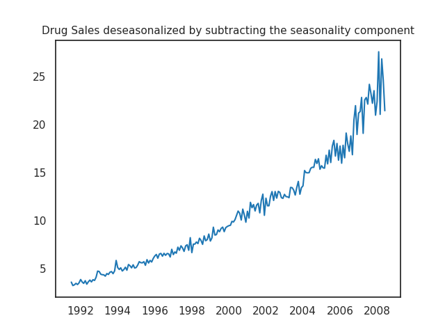

**Takeaway:**  
Separating trend and seasonality improves interpretability and prepares data for forecasting.

---

### 3️⃣ Sequential Text Data — DNA & Tweets
- **DNA Class Distribution**  
  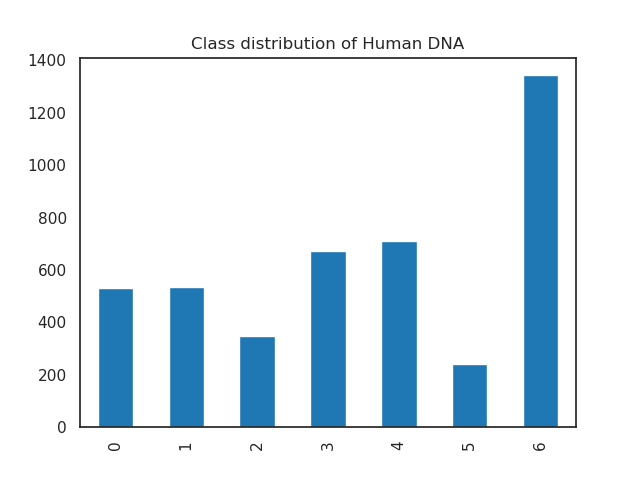

- **Tweets Per Category**  
  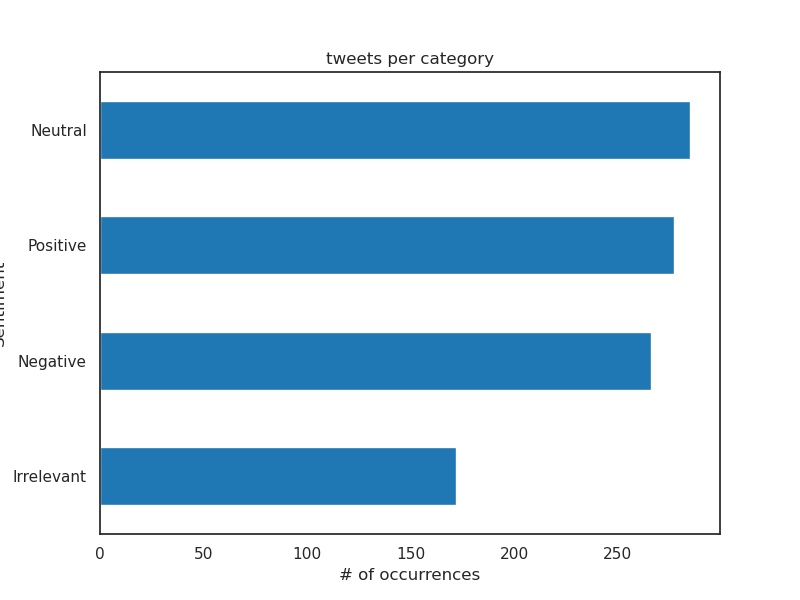

**Takeaway:**  
Understanding class distribution is essential for avoiding model bias in sequence classification tasks.

---

### 4️⃣ Audio Data — Spectrogram Analysis
- **Raw Audio Plotting**  
  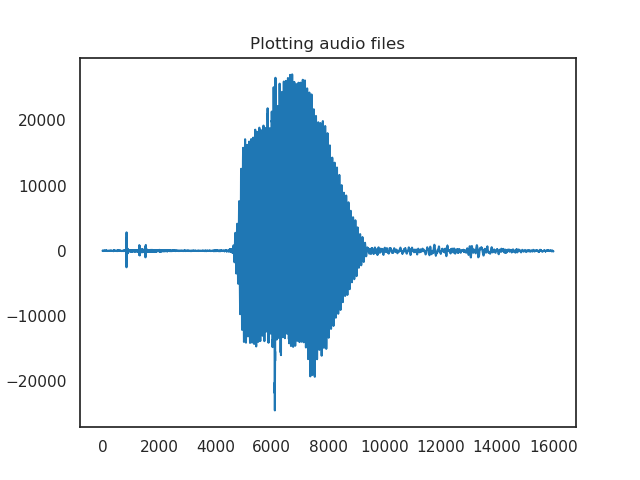

- **Spectrogram Representation**  
  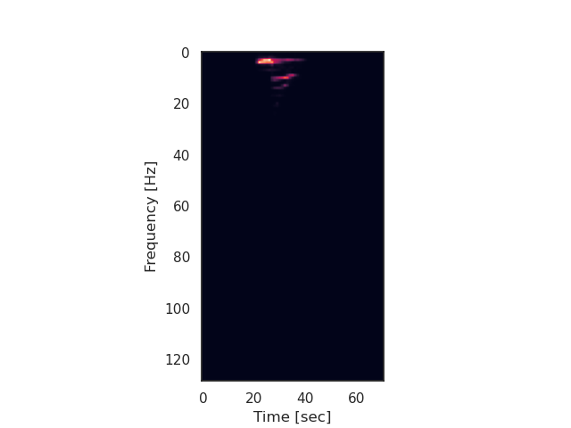

**Takeaway:**  
Spectrograms transform audio into a **time-frequency representation**, crucial for speech/music recognition.

---

### 5️⃣ Financial Sequential Data — Stocks
- **Stock Values Over Time**  
  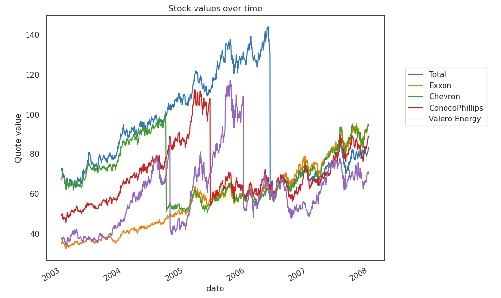

**Takeaway:**  
Stock data exhibits both trend and short-term fluctuations; sequential modeling can capture these dependencies.

---

### 6️⃣ Model Training & Evaluation
Experiments compared different ways of splitting sequential data for model evaluation:

- **Without Shuffling** (preserves order)  
  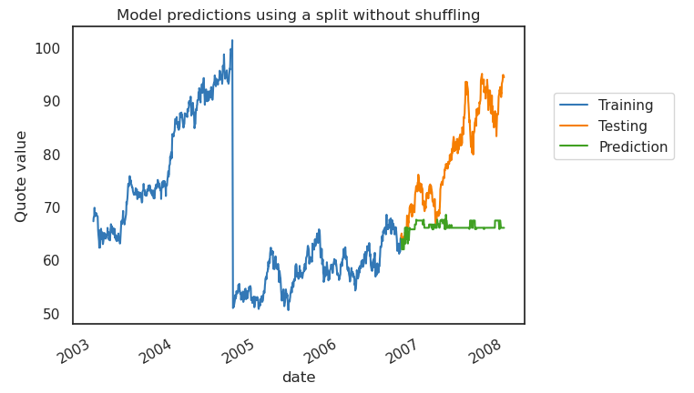

- **With ShuffleSplit** (randomized)  
  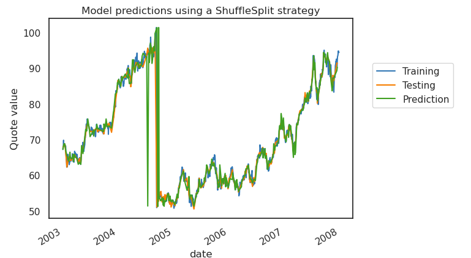

**Key Insight:**  
- Sequential data often requires **order-preserving splits** to avoid data leakage.  
- Shuffle-based evaluation may inflate accuracy but fails to mimic real forecasting scenarios.

---

## 🧪 Methods Applied

- **Data Imputation:** forward fill, backward fill, linear interpolation  
- **Time Series Decomposition:** additive & multiplicative  
- **Data Transformation:** detrending, deseasonalizing  
- **Sequence Classification:** categorical distribution of DNA and tweets  
- **Audio Processing:** waveform plots, spectrograms  
- **Financial Analysis:** trend exploration in stock prices  
- **Evaluation Strategies:** time-aware train-test split vs shuffle-based splits

---

## 📊 Results Summary

- **Imputation:** Linear interpolation provided smoother results compared to forward/backward fill.  
- **Decomposition:** Both additive and multiplicative decomposition revealed clear **seasonality** in sales data.  
- **Classification:** Tweet categories and DNA sequences showed **imbalanced class distributions**, highlighting the need for stratification.  
- **Audio Analysis:** Spectrograms captured frequency patterns over time, making audio data suitable for ML.  
- **Stock Analysis:** Observed trends and volatility useful for predictive modeling.  
- **Model Evaluation:** Non-shuffled splits better simulate real-world forecasting tasks.

---

## 🛠️ Tech Stack

- **Python 3.10+**, **Jupyter Notebook/Lab**  
- **Libraries:** `pandas`, `numpy`, `matplotlib`, `seaborn`, `scikit-learn`, `scipy`, `librosa` (for audio), `statsmodels`

---

## ▶️ How to Run

```bash
# 1) Clone the repo
git clone https://github.com/ShyamSundarVijayakumar/machine_learning_for_sequencial_data.git
cd machine_learning_for_sequencial_data

# 2) (Optional) Create venv
python -m venv venv
source venv/bin/activate   # Linux/macOS
.\venv\Scripts\activate    # Windows

# 3) Install dependencies
pip install -r requirements.txt

# 4) Launch notebook
jupyter lab

```
Open `types-of-sequential-data.ipynb` to explore the workflow.

---

## ✅ Key Takeaways

- Sequential data appears across domains: **time series, text, audio, finance**.
- **Preprocessing matters**: imputing missing values and decomposing data improves downstream models.
- **Visualization is powerful**: trends, cycles, and seasonality become clearer via decomposition and plots.
- **Evaluation strategy matters**: for sequential prediction, **time-respecting splits** are more realistic than random shuffling.

---

## 💡 Suggestions / Next Steps

- **Forecasting models**: Apply ARIMA, SARIMA, or Prophet for time series prediction.
- **Deep learning**: Use RNNs, LSTMs, or Transformers for sequential modeling tasks.
- **Augmentation**: For audio and text, explore data augmentation to improve model robustness.
- **Feature extraction**: Incorporate lag features, rolling averages, or MFCCs (for audio).
- **Cross-domain benchmarking**: Compare how different models handle structured vs unstructured sequential data.

---

## 👨‍💻 Author
<div style="display: flex; align-items: center; gap: 20px">  <div> <strong>Shyam Sundar Vijayakumar</strong><br> Data Scientist | Optimization Specialist </div> </div>

---

## 📜 License
This project is licensed under the MIT License.
Shared for educational and portfolio purposes. Attribution is appreciated.
